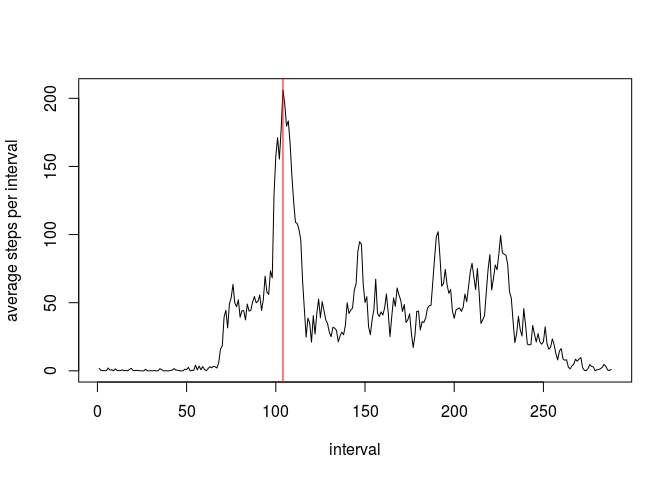
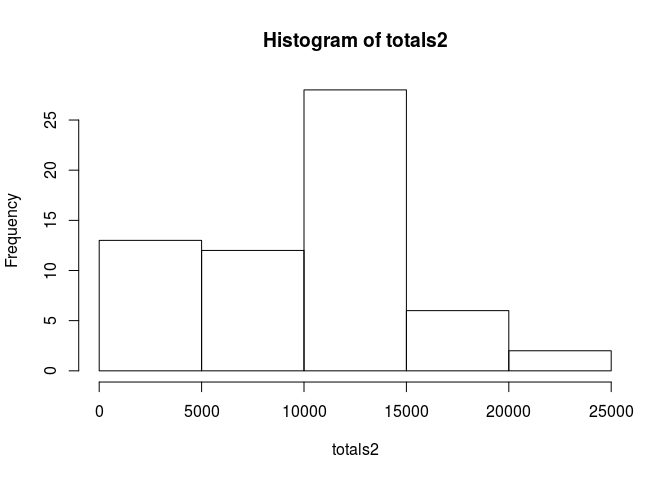
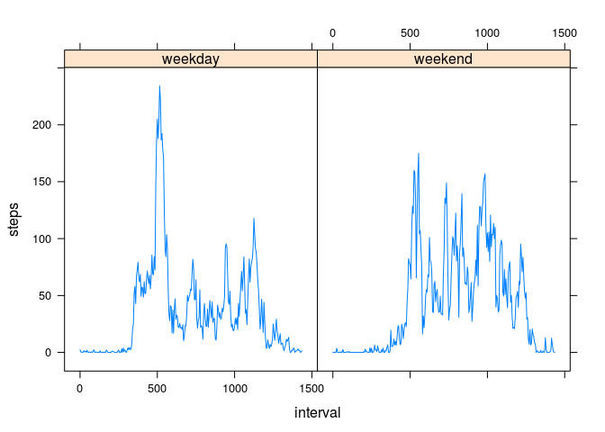

# Reproducible Research: Peer Assessment 1


## Loading and preprocessing the data


```r
data <- read.csv("activity.csv", header = TRUE, na.strings = "NA")
data$date <- as.Date( data$date )
```

## What is mean total number of steps taken per day?
* Calculate the total number of steps taken per day
* Make a histogram of the total number of steps taken each day
* Calculate and report the mean and median of the total number of steps taken per day

```r
totals <- tapply( data$steps, data$date, sum, na.rm = TRUE )
hist(totals)
```


```r
mean(totals)
```

```
## [1] 9354.23
```

```r
median(totals)
```

```
## [1] 10395
```


## What is the average daily activity pattern?

```r
average_per_interval <- tapply( data$steps, data$interval, mean, na.rm = TRUE )

plot( average_per_interval, type = "l", xlab = "interval", ylab="average steps per interval")
maksi <- which.max(average_per_interval)
maksi
```

```
## 835 
## 104
```

```r
abline(v=maksi, col="red")
```



## Imputing missing values

```r
sum(is.na(data$steps))
```

```
## [1] 2304
```

```r
data2 <- data

days <- unique( data$date )
for (a_day in days)
{
  a_mean <- mean(data$steps[ data$date==a_day ], na.rm = TRUE  )
  if (!is.nan(a_mean))
    data2$steps[ is.na(data2$steps) & data$date==a_day  ] <- a_mean
  else
    data2$steps[ is.na(data2$steps) & data$date==a_day  ] <- 0
}

totals2 <- tapply( data2$steps, data2$date, sum, na.rm = TRUE )
hist(totals2)
```



```r
mean(totals2)
```

```
## [1] 9354.23
```

```r
median(totals2)
```

```
## [1] 10395
```


## Are there differences in activity patterns between weekdays and weekends?

```r
data$weekdays <- weekdays( data$date )
data$weekdays[ data$weekdays %in%  c("понеделник", "вторник", "среда", "четврток", "петок") ] <- "weekday"
data$weekdays[ data$weekdays %in%  c("сабота","недела") ] <- "weekend"

average_per_interval_weekend <- tapply( data$steps[ data$weekdays=="weekend" ], data$interval[ data$weekdays=="weekend" ], mean, na.rm = TRUE )
average_per_interval_weekday <- tapply( data$steps[ data$weekdays=="weekday" ], data$interval[ data$weekdays=="weekday" ], mean, na.rm = TRUE )

steps <- c( average_per_interval_weekend, average_per_interval_weekday )
day <- c(  rep( "weekend",length(average_per_interval_weekend) ),  rep( "weekday",length(average_per_interval_weekday) ) )
interval <- seq.int(0, 287*5, 5)
df <- data.frame( steps,day,interval )

library(lattice)
xyplot(data=df, steps~interval|day,  type='a')
```



